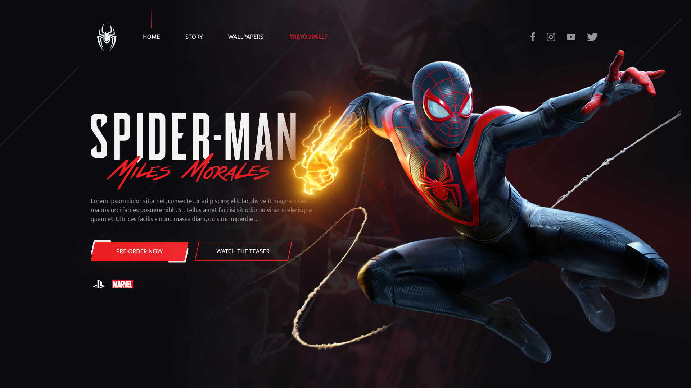

<h1 align="center">
    Spider-man: Miles Morales 
</h1>

  

  

  

  <a href="#-tecnologias">Tecnologias</a>&nbsp;&nbsp;&nbsp;|&nbsp;&nbsp;&nbsp;
  <a href="#-projeto">Projeto</a>&nbsp;&nbsp;&nbsp;|&nbsp;&nbsp;&nbsp;
  <a href="#-rotas%da%aplicação">Screenshots</a>&nbsp;&nbsp;&nbsp;

 

## 🚀 Tecnologias

Esse projeto foi desenvolvido com as seguintes tecnologias:

- HTML
- JS
- SCSS

 

## 💻 Projeto

Projeto criado durante a semana a FrontWeek​ do [Násser Yousef](https://www.nyousefali.com.br)

 

 

---

Feito by André Junior :wave: [portifólio](https://andrejr.dev)
